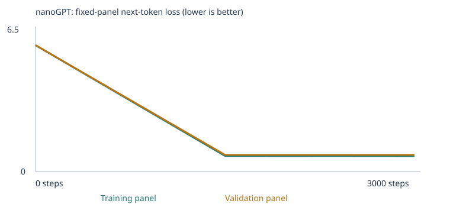

# Class 4: Building a Custom LLM with nanoGPT

Two experiments training Karpathy's nanoGPT on a small word-token corpus, evaluated with the
provided 48-case language eval suite before and after training, plus a working chat interface.

- **Experiment 1 (starter):** the supplied classroom corpus only.
- **Experiment 2 (extended):** the classroom corpus plus two teaching files I wrote for the
  **opposites** and **negation** eval categories.

Model: 2 blocks, 4 heads, 64-number embeddings, 48-token context, whole-word tokenization,
PyTorch with AdamW. Trained on CPU in Google Colab.

---

## 1. Headline comparison

| Result set | All-case | Scorable cases | extend_corpus | starter_patterns | starter_transfer |
|---|---|---|---|---|---|
| Exp 1 — untrained | 9/48 (18.8%) | 24/48 | 0/24 (0 scorable) | 6/16 | 3/8 |
| Exp 1 — trained | 20/48 (41.7%) | 24/48 | 0/24 (0 scorable) | 16/16 | 4/8 |
| Exp 2 — untrained | 7/48 (14.6%) | 28/48 | 0/24 (4 scorable) | 5/16 | 2/8 |
| Exp 2 — trained | 24/48 (50.0%) | 28/48 | 1/24 (4 scorable) | 16/16 | 7/8 |

Scorable accuracy: Exp 1 went 9/24 (37.5%) → 20/24 (83.3%). Exp 2 went 7/28 (25.0%) → 24/28 (85.7%).

**Result sets:** [exp1 untrained](llm_runs/20260922T210439_859052Z/language_evals/untrained/) · [exp1 final](llm_runs/20260922T210439_859052Z/language_evals/final/) · [exp2 untrained](llm_runs/20260922T214458_340639Z/language_evals/untrained/) · [exp2 final](llm_runs/20260922T214458_340639Z/language_evals/final/)

Important caveat: this is a **public development benchmark**. I read the eval cases to decide what
to teach, so these numbers cannot be treated as evidence of generalization to unseen tests.

---

## 2. Setup and my three choices

| | Exp 1 | Exp 2 |
|---|---|---|
| Corpus | classroom only | classroom + 2 files |
| Training steps | 3,000 | 3,000 |
| Learning rate | 0.001 | 0.001 |
| Vocabulary | 136 | 353 |
| Unique documents | 4,592 | 4,876 |
| Train / validation | 4,132 / 460 | 4,388 / 488 |
| Training unknown rate | 0.00% | 0.00% |
| Held-out unknown rate | 0.00% | 0.13% |
| Parameters | 0.11M | 0.12M |
| Embedding table | 136 × 64 = 111,872 | 353 × 64 = 125,760 |
| Elapsed | 60.08s | 62.73s |
| Run ID | `20260922T210439_859052Z` | `20260922T214458_340639Z` |

Hardware: Colab default CPU runtime — Linux-6.6.122+-x86_64-with-glibc2.39, device `cpu`.
Python 3.13.15, PyTorch 2.11.0+cpu. Both runs completed without interruption: 3,000 of 3,000 steps.

**Why these settings.** A 10-step run confirmed the setup worked; 3,000 steps is the suggested
budget and gives the model enough weight updates to learn the corpus's repeated sentence templates
while still finishing in about a minute on CPU. 0.001 is a standard AdamW starting point: too large
and the updates overshoot and loss becomes unstable; too small and 3,000 steps would not be enough
to see progress. The notebook warms the learning rate up from a much smaller value and then decays
it on a cosine schedule, which is why the very first recorded update uses a learning rate of 1e-05
rather than 0.001.

I held steps and learning rate fixed across both experiments so that the corpus was the only
variable that changed.

### Corpus sources and permissions

Both runs use the notebook's generated classroom sentences. Experiment 2 adds two plain-text files
I wrote myself for this assignment, so there are no third-party permissions to clear and no
confidential or personal data involved:

| File | Passages | Purpose |
|---|---|---|
| [`corpus/opposites_lesson.txt`](corpus/opposites_lesson.txt) | 105 | teach the opposites category |
| [`corpus/negation_lesson.txt`](corpus/negation_lesson.txt) | 179 | teach the negation category |

284 new unique passages total. No PDFs were used, so there was no extraction or OCR step and no
page warnings to check. See [`corpus_manifest.json`](llm_runs/20260922T214458_340639Z/corpus_manifest.json) and [`vocabulary_report.json`](llm_runs/20260922T214458_340639Z/vocabulary_report.json).

---

## 3. My prediction, and what actually happened

**Predicted before training:** starting loss near ln(509) ≈ 6.2, a steep drop in the first few
hundred steps then a flattening, validation ending slightly above training, untrained eval accuracy
around 25% (chance for four choices), large gains on starter_patterns, small gains on
starter_transfer, and near-zero on the extension cases because the words are missing.

**What actually happened, and where I was wrong:**

1. **The vocabulary was far smaller than I assumed.** I predicted starting loss from a 509-word
   vocabulary, but 509 is the *cap*, not the size. Exp 1 built a 136-word vocabulary and Exp 2 a
   353-word one, with **0 omitted types in both runs** — the corpus simply never contained that
   many distinct words. Starting loss tracked the real vocabulary almost exactly: 4.926 vs
   ln(136) = 4.91, and 5.863 vs ln(353) = 5.87. The reasoning was right; the input number was wrong.
2. **Untrained accuracy was above chance in Exp 1.** I predicted ~25%; Exp 1 scored 9/24 = 37.5%
   scorable. With only 24 scorable cases, random initialization plus a handful of lucky rankings
   moves the number several points. Exp 2's untrained run came in at 25.0%, right at chance.
3. **The loss curve behaved as predicted** — steep early drop, flat second half, validation slightly
   above training.
4. **starter_transfer improved much more than I expected in Exp 2** (4/8 → 7/8). I did not predict
   this and cannot fully attribute it. See §7.

---

## 4. Corpus, tokens, IDs, vectors, and learning

All numbers below are from **Experiment 2** unless stated.

### A word becomes a token, an ID, and a vector

The **corpus** is the collection of training sentences. The tokenizer splits text into whole words
and punctuation marks — **tokens**. Each distinct token type in the vocabulary gets an integer
**ID**, assigned by frequency rank. One training document tokenizes like this:

```
Text:   the buyer recommended the item after checking the price .
Tokens: ['the','buyer','recommended','the','item','after','checking','the','price','.']
IDs:    [1, 305, 46, 243, 305, 149, 7, 57, 305, 233, 4, 2]
```

(IDs 1 and 2 are the `<BOS>` and `<EOS>` markers wrapping the sentence.)

Tracing one word all the way through: **`customer` is token ID 77** in Experiment 2. In Experiment 1
the same word is **ID 28**. Nothing about the word changed — an ID is just a row number in a lookup
table, and the two corpora produced different frequency rankings.

That row holds 64 numbers, the **embedding vector**. Before training, `customer`'s vector starts as:

```
[-0.0019, 0.0107, -0.0223, 0.0214, -0.0217, -0.0271, -0.0250, -0.0335, ...]
```

After 3,000 steps it is:

```
[-0.0655, 0.0146, 0.0310, 0.0108, 0.0462, -0.1105, 0.0294, 0.0071, ...]
```

The values grow roughly tenfold in magnitude. Total movement in the full 64-dimensional space:
**0.610** (vector distance). No coordinate has a human-readable meaning; they are only useful in
combination.

Evidence: [`tokenization.json`](llm_runs/20260922T214458_340639Z/tokenization.json) · [`inspection.json`](llm_runs/20260922T214458_340639Z/inspection.json) · [`checkpoint.json`](llm_runs/20260922T214458_340639Z/checkpoint.json)

### One gradient and one weight update

**Loss** measures how much probability the model put on the token that actually came next. A perfect
prediction gives loss near 0; uniform guessing over 353 words gives about ln(353) = 5.87, which is
exactly where training starts.

**Backpropagation** computes, for every one of the ~120,000 parameters, a **gradient**: the direction
and amount that parameter would need to move to reduce the loss. **AdamW** then applies the update.

The first recorded update in Experiment 2:

```
token:    customer
coordinate: 0
before:   -0.0019195593195036054
gradient: -0.0051349252462387085
learning rate: 1e-05
after:    -0.0019095591269433498
```

The parameter moved by about 0.00001 — a negative gradient pushes the value up. One update is
almost invisible; 3,000 of them across every parameter is what produces the change in §4 above.

`Basically, the model guessed, got told how badly it guessed, and nudged one number. After
seeing the phrase "the customer," it spread its guesses across all 353 words. The loss was
high because it put barely any weight on the word that actually came next. The gradient was
-0.0051 and it told this one number which way to move to make that kind of mistake smaller,
and because the gradient was negative the number moved up, from -0.00191956 to -0.00190956.
The learning rate of 1e-05 is what kept the step small. A change this small won't change
anything on its own, but the model did this to every one of its ~120,000 numbers, 3,000 times.`

### What the model learned to predict

Next-token probabilities after the prompt `the customer`:

| Before training | After training |
|---|---|
| customer 0.0055 | compared 0.2048 |
| buyer 0.0045 | selected 0.1840 |
| small 0.0045 | reviewed 0.1674 |
| read 0.0043 | ordered 0.1608 |
| salad 0.0042 | recommended 0.1462 |

Before training every word sits near 1/353 ≈ 0.0028 — near-uniform guessing, with `salad` about as
likely as `bought`. After training the top five are all verbs a customer plausibly performs, each
carrying 15–20% of the probability mass. This is the single clearest piece of learning evidence in
the run.

### Which embedding neighbors changed

Nearest neighbors of `customer` by cosine similarity in the full 64-dimensional space:

| | Neighbor 1 | Neighbor 2 | Neighbor 3 |
|---|---|---|---|
| Before training | dry (0.370) | heavy (0.314) | kept (0.312) |
| After training | client (0.981) | consumer (0.976) | buyer (0.969) |

Before training the neighbors are arbitrary — random 64-dimensional vectors point in mostly
unrelated directions, so nothing is strongly aligned with anything. After training, the three
closest words are all people who buy things. The model was never given a definition; it grouped
these words because the corpus uses them in interchangeable sentence positions.

**Why the 3D map is imperfect:** the viewer uses PCA to compress 64 dimensions into 3 and retains
only **35.7% of the variance**, so about two thirds of the structure is not visible. Two dots that
look adjacent on screen may be far apart in the real space. The cosine numbers above use all 64
dimensions and are the reliable measure.

**A limitation visible in these numbers:** 0.97–0.98 similarity means the model treats client,
consumer, buyer and customer as nearly the same direction. That is tighter than real language
warrants — it reflects how narrow the corpus is. Nothing in the training data ever required the
model to distinguish them.

---

## 5. Attention, sampling, and temperature

**Attention** lets each position weight the earlier tokens in the context when predicting the next
one. First-head attention weights on a three-token prompt (Exp 2):

```
position 1: [1.000, 0,     0    ]
position 2: [0.367, 0.633, 0    ]
position 3: [0.573, 0.392, 0.034]
```

Each row sums to 1 and the upper triangle is zero, because a position can only attend to itself and
what came before it. The first token has nowhere else to look, so it puts all its weight on itself.

**From probabilities to words:** the network outputs a score for every one of the 353 vocabulary
entries, softmax turns those into probabilities, and the sampler draws one token. That token is
appended and the process repeats.

**Temperature** rescales those probabilities before sampling. It changes nothing about the weights
— the model is identical at all three settings.

| Temp | Sample (Exp 2) |
|---|---|
| 0.3 | `the report about the bus explains the route in detail .` |
| 0.8 | `a review of taste helped us understand the new pear .` |
| 1.2 | `design is the opposite of dirty .` |

Low temperature sharpens the distribution toward the highest-probability token and produces clean,
repetitive template sentences. High temperature flattens it and lets lower-ranked words through.

The 1.2 sample is the most revealing line in this run. `design is the opposite of dirty .` has the
exact frame taught by my opposites file, filled with words that make no sense together. The model
learned the *shape* of the pattern without learning which words belong in the slots.

Worth noting: in **Experiment 1**, temperatures 0.8 and 1.2 produced **identical** samples. With a
136-word vocabulary and heavily repeated templates, the distribution is so peaked that even high
temperature could not shake it loose. The larger Exp 2 vocabulary is what made the temperature
comparison informative at all.

Evidence: [`temperature_comparison.json`](llm_runs/20260922T214458_340639Z/temperature_comparison.json) · [`config.json`](llm_runs/20260922T214458_340639Z/config.json)

---

## 6. Training curves and samples



Full loss table (Experiment 2), from [`history.json`](llm_runs/20260922T214458_340639Z/history.json):

| Step | Training loss | Validation loss |
|---|---|---|
| 0 | 5.8631 | 5.8662 |
| 1500 | 0.7245 | 0.7748 |
| 3000 | 0.7177 | 0.7727 |

Experiment 1 for comparison: 4.9263 / 4.9275 → 0.6821 / 0.7182 → 0.6783 / 0.7061.

These are **fixed evaluation panels of at most 20 training and 20 validation documents**, averaging
non-padding next-token targets. They are small estimates, not full-corpus measurements. Losses from
Exp 1 and Exp 2 are **not directly comparable** — different corpora build different vocabularies, and
a 353-way prediction problem starts from a higher loss than a 136-way one.

### Sample timeline (Experiment 2, same generation settings throughout)

**Untrained (step 0):**
```
payment drawer ball tutor found round we dry sat bag kettle harvest white route risk folder
guest student loan wide clerk helped helped white new package milk banana street soup take border
```

**Halfway (step 1500):**
```
a review of price helped us understand the new merchandise .
today the store focused on support and the new customer .
```

**Final (step 3000):**
```
a review of taste helped us understand the new pear .
today the store focused on purchase and the new customer .
we learned about the new tutor during a discussion of lesson .
```

The untrained output is an unordered pile of vocabulary words with no grammar. By step 1500 the
sentences are already grammatical and template-shaped. Between 1500 and 3000 almost nothing changes
— which matches the loss curve, where the training loss moves only from 0.7245 to 0.7177 across the
entire second half of training.

**What remains unconvincing:** falling training loss does not demonstrate generalization. The
validation split is a 90/10 passage split, and passages from the same source share templates with
training passages, so plausible output here says nothing about unseen sentence structures. The Exp 2
free continuations in §8 make that concrete.

Full saved samples: [`samples/`](llm_runs/20260922T214458_340639Z/samples/)

---

## 7. Eval analysis

Scoring: the runner sends **only the prompt prefix** to the model — never the four choices, never the
answer key — and scores 1 when the correct word receives the highest probability among the four
choices. Ties score 0. Cases where any prompt or answer word is outside the vocabulary are marked
**unscorable** and count as zero in the all-case rate. The runner never updates weights.

### What improved, and what didn't

**Vocabulary coverage rose from 24 to 28 scorable cases.** This is the clearest causal result: my two
corpus files put words into the vocabulary that made 4 previously untestable extension cases
testable for the first time. New data, new vocabulary, new measurable cases.

**Only 4 of a possible 6 opposites/negation cases became scorable.** Coverage is decided word by
word, not category by category. My opposites file never used the word `loud`, which appears among
the choices in one case, and my negation file never used the name `ava`, which appears in another
prompt. A single missing word keeps a case unscorable no matter how well the pattern was taught.

**The extension score barely moved: 0/24 → 1/24.** The model picked up the frames but not the
slot-filling logic. This is the central negative finding of the assignment, and it is corroborated
three separate ways: the temperature-1.2 sample (`design is the opposite of dirty .`), the chat
interactions in §8, and the eval score itself.

**starter_transfer improved unexpectedly: 4/8 → 7/8.** Those 8 cases use familiar words in new
phrasings, and they were the weak spot in Experiment 1. I did not predict this and cannot fully
attribute it — it is one run over 8 cases with a vocabulary that also changed between experiments,
so some of it may be noise rather than a real effect of the added data. Reporting it as an observed
change rather than a demonstrated causal improvement.

**Both untrained scores dropped between experiments** (9/48 → 7/48, starter_patterns 6/16 → 5/16).
This is expected, not a bug: a different corpus builds a different vocabulary and a differently
shaped randomly-initialized model, so untrained numbers are not comparable across experiments.

### Category breakdown

`Per-category results, Experiment 2 (the notebook's summary only breaks down by group, so these
come from the per-case files in `language_evals/`):

| Group | Category | Cases | Scorable | Untrained | Trained |
|---|---|---|---|---|---|
| starter_patterns | domain_context | 8 | 8 | 2 | 8 |
| starter_patterns | domain_place | 8 | 8 | 3 | 8 |
| starter_transfer | new_wording | 8 | 8 | 2 | 7 |
| extend_corpus | opposites | 3 | 2 | 0 | 0 |
| extend_corpus | negation | 3 | 2 | 0 | 1 |
| extend_corpus | grammar | 3 | 0 | 0 | 0 |
| extend_corpus | reference | 3 | 0 | 0 | 0 |
| extend_corpus | sequence | 3 | 0 | 0 | 0 |
| extend_corpus | spatial_relations | 3 | 0 | 0 | 0 |
| extend_corpus | everyday_knowledge | 3 | 0 | 0 | 0 |
| extend_corpus | categories_and_analogies | 3 | 0 | 0 | 0 |

**The 4 newly scorable cases are exactly the two categories I targeted.** No case in any of the
other six extension categories became scorable, which confirms the coverage gain came from my
corpus files and not from chance:

| Case | Category | Prompt | Expected | Predicted | Score |
|---|---|---|---|---|---|
| lang_28 | opposites | the opposite of hot is | cold | heavy | 0 |
| lang_29 | opposites | the opposite of empty is | full | soft | 0 |
| lang_31 | negation | the box is not red . it is blue . the box is | blue | red | 0 |
| lang_33 | negation | the door is not open . it is closed . the door is | closed | **closed** | **1** |

**The one success is narrow.** On lang_33 the model ranked `closed` at 0.1096 against `open` at
0.0891 — a 2-point margin, with the two irrelevant choices far below at 0.003 and 0.001. So it
learned that this frame is about doors being open or closed, and picked the right one, but not by
much.

**The one failure that matters most is lang_31.** The four choice probabilities were green 0.0144,
yellow 0.0155, blue 0.0172, red 0.0187 — effectively a flat distribution, and the model picked
`red`, the word the sentence explicitly negates. This is the clearest evidence that it did not learn
the correction logic. My negation file deliberately reversed every pair so that copying the
second-mentioned word would not work; the model appears to have learned neither strategy, and is
close to guessing.

**The two missing cases were lost to single words.** lang_30 (noisy/quiet) is unscorable because
`loud` appears among its choices and my opposites file never used that word. lang_32 is unscorable
because the prompt contains the name `ava`, which my negation file never used. Two words, two cases.
This is the sharpest illustration of how coverage works: it is decided word by word, not category by
category, and a file that teaches a pattern well still loses a case to one absent token.

**The other six categories fail for a much larger reason than two words.** Their unknown-word lists
span whole semantic fields my corpus never touches — sequence needs `first`, `last`, `then`, `wash`,
`breakfast`, `lunch`; spatial_relations needs `above`, `below`, `inside`, `left`; grammar needs
`were`, `am`, `walking`, `walks`; categories_and_analogies needs `robin`, `salmon`, `puppy`,
`kitten`, `carrot`, `vegetable`. Making those scorable would require teaching material on the scale
of what I wrote for two categories, multiplied across six.

**Note on absolute probabilities.** The values above are small (mostly 0.01–0.03) because the model
distributes probability across all 353 vocabulary entries. Scoring only compares the four listed
choices against each other, so a case can be scored correct while the winning word still holds a
small share of the model's total probability mass.`

### Eval separation

- Eval material lives in `evals/`, outside `corpus/`. `CORPUS_FOLDER` pointed only at `corpus/`.
- The notebook excluded **160 reserved eval passages** before splitting data or building the
  vocabulary, in both runs.
- My two teaching files deliberately avoid the tested items. The opposites file teaches the
  "the opposite of X is Y" frame using 16 pairs that are *not* tested (big/small, old/new, fast/slow,
  wet/dry and so on). The tested words — hot, cold, empty, full, noisy, quiet — appear only in plain
  descriptive sentences such as `the tea in the cup is hot .`, never inside the tested frame. Those
  words must exist in the vocabulary or the cases stay permanently unscorable, but putting them in
  the tested frame would be teaching to the test.
- The negation file uses the same two frames with entirely different subjects and objects than the
  test cases, and reverses each pair so the model cannot succeed by always copying the
  second-mentioned word.
- Verification: [`eval_separation.json`](llm_runs/20260922T214458_340639Z/eval_separation.json) · [`corpus_manifest.json`](llm_runs/20260922T214458_340639Z/corpus_manifest.json) · [`corpus.txt`](llm_runs/20260922T214458_340639Z/corpus.txt)

---

## 8. Chat interface

Run the notebook's **section 10**: edit `CHAT_PROMPT`, then run the cell. Each message starts with a
fresh context — there is no conversation memory. Terminal alternative:

```bash
python chat.py --model llm_runs/20260922T214458_340639Z/model.pt
```

This is a **tiny language model**. It continues text rather than answering questions. Its vocabulary
is 353 words; anything outside that is reported as an unknown word. Context is capped at 48 tokens.
Generating replies never retrains the model and never adds chat text to the corpus.

Model used: run `20260922T214458_340639Z`, 3,000 completed steps.

### Experiment 2 interactions

| Prompt | Reply | Unknown words |
|---|---|---|
| `the opposite of hot is` | `shelf .` | none |
| `the shop is not open . it is` | `not market .` | none |
| `what is the capital of France` | `and the different platform .` | capital, france, what |

### Experiment 1 interactions, for comparison

| Prompt | Reply | Unknown words |
|---|---|---|
| `the customer` | `selected the item after checking the price .` | none |
| `the manager reviewed the` | `local investment focused on interest and return .` | manager |
| `what is the capital of France` | `the important peach focused market .` | capital, france, is, what |

### Observed limitations

**The chat confirms the eval finding.** Both extension prompts produced no unknown-word warning,
meaning `opposite`, `hot`, `open` and `not` are all in the vocabulary — my corpus files worked at the
token level. Both replies are still wrong. Vocabulary coverage and pattern learning are separate
failure modes, and I fixed the first without fixing the second.

**Fluent output is not understanding.** The Experiment 1 reply to `the manager reviewed the` reads as
a grammatical business sentence, but `manager` was an unknown word — the model produced confident
text from a prompt it could not actually read. That is a sharper limitation than a garbled response
would have been.

**The same failing prompt across both models** shows the vocabulary change and nothing more: unknown
words dropped from four to three because `is` entered the vocabulary in Exp 2. The reply is equally
meaningless. The model has no mechanism for answering a question.

Evidence: [`chat_transcript.json`](llm_runs/20260922T214458_340639Z/chat_transcript.json) · screenshots in [`evidence/`](evidence/)

---

## 9. One limitation and one next experiment

**Limitation.** `I think the biggest limitation is that the model never learned negation, only the shape of a
negation sentence. On lang_31 it was told the box is not red and that it is blue, then asked
what the box is. It picked red, which was the one word the sentence rules out. The four colors
came back at 0.0144, 0.0155, 0.0172 and 0.0187, which is close to a flat distribution, so it
was barely choosing at all. To the model "not red" is just a context where the word red
recently appeared, which makes red more likely rather than less. I used Claude to draft 179
negation passages, reversing every pair so that copying the second-mentioned word would not
work, but the model didn't learn the copying shortcut or the actual rule. More training steps
would not fix this on their own, because the problem is not that the model practiced too
little. Whether it is the model's size or the amount of negation data is what my next
experiment would test.`

**Next experiment.** `My limitation says the model might lack either the capacity or the data to learn negation, and
my next experiment would separate those. I would keep the corpus, the steps, and the learning
rate exactly as they are, but I would raise n_layer from 2 to 4, which would double the depth
but leave everything else fixed. If lang_31 and lang_33 improve, the problem was capacity
and 179 passages were enough teaching material. If the score stays flat and the four colors
stay near a flat distribution, the problem was the data, and the follow-up would be to hold
the model fixed and multiply the negation passages instead. I would also add the words loud
and ava to my corpus files, since those two words kept two teachable cases unscorable,
and their absence has nothing to do with whether the pattern was learned.`

---

## 10. How to reproduce

**Run the training notebook.** Open [`custom_llm.ipynb`](custom_llm_exp2.ipynb) in Colab (default CPU runtime is
enough) or locally with `pip install -r requirements.txt`. For Experiment 2, upload
`opposites_lesson.txt` and `negation_lesson.txt` into `corpus/` first. Keep `CORPUS = "classroom"`,
`TRAINING_STEPS = 3000`, `LEARNING_RATE = 0.001`. Select Run All. Sections 6b and 8b run the evals
before and after training automatically.

**Rerun the evals against a saved model:**

```bash
python run_evals.py --model llm_runs/<run_id>/model.pt --evals evals/language_evals.json
```

See [`evals/README.md`](https://github.com/pepealonso95/custom-llm/blob/main/evals/README.md) for the
exact runner options.

**Launch the chat interface:** section 10 of the notebook, or `python chat.py --model
llm_runs/<run_id>/model.pt`. Dependencies are the same `requirements.txt`; no API key and no
pretrained weights are needed.

**Inspect the embeddings:** download `embedding-viewer.html` from the
[sample repository](https://github.com/pepealonso95/custom-llm), open it locally, and load
`checkpoint.json` from either run folder. `checkpoint.json` holds initial and final embeddings for
the viewer; `model.pt` holds the full network for inference. Neither is an exact training-resume file.

---

## 11. Repository contents

```
custom_llm_exp1.ipynb              executed notebook, starter corpus
custom_llm_exp2.ipynb              executed notebook, extended corpus
corpus/opposites_lesson.txt        my teaching data, opposites
corpus/negation_lesson.txt         my teaching data, negation
evals/language_evals.json          the 48 fixed cases, unchanged
run_evals.py                       eval runner
chat.py                            terminal chat interface
nanogpt_model.py                   pinned nanoGPT source
llm_runs/20260922T210439_859052Z/  experiment 1 results
llm_runs/20260922T214458_340639Z/  experiment 2 results
evidence/                          chat screenshots, embedding viewer screenshots
```

Each run folder contains `config.json`, `corpus.txt`, `corpus_manifest.json`,
`vocabulary_report.json`, `split.json`, `tokenization.json`, `inspection.json`, `history.json`,
`training.csv`, `training_summary.json`, `checkpoint.json`, `model.pt`, `model_untrained.pt`,
`training_curves.svg`, `samples/`, `temperature_comparison.json`, `eval_separation.json`,
`language_evals/` and `chat_transcript.json`.
